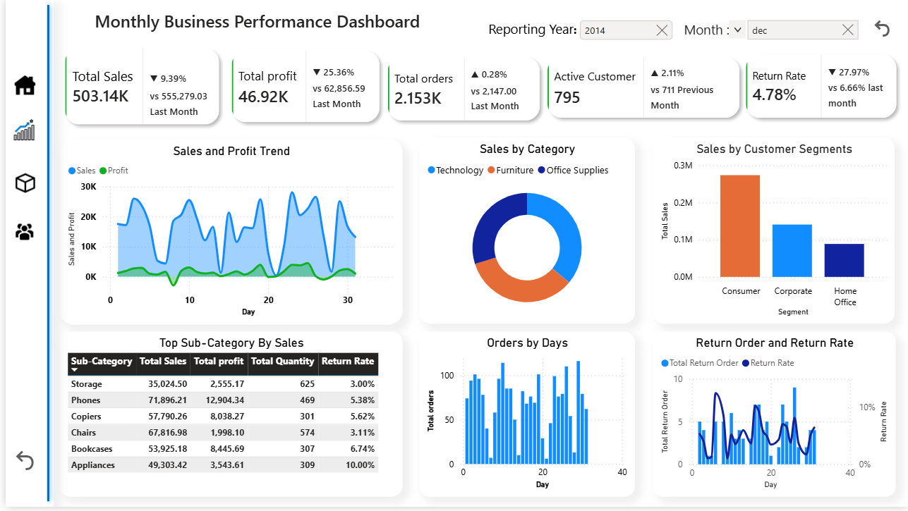

# 📊 Retail Sales Analytics Dashboard | Power BI

<p align="center">
  
</p>

<p align="center">
  <strong>An interactive Business Intelligence solution built with Microsoft Power BI for analyzing Sales, Profitability, Products, and Customer Performance.</strong>
</p>

---

# 📖 Project Overview

This project is a **multi-page interactive Power BI dashboard** developed to simulate a real-world Business Intelligence solution for a retail business.

Organizations generate thousands of sales transactions every day. Analyzing raw transactional data manually is time-consuming and often fails to provide meaningful business insights. This dashboard transforms raw sales data into an intuitive and interactive reporting solution that enables users to monitor business performance, identify trends, evaluate profitability, and make informed decisions.

The dashboard combines executive-level KPIs with detailed analytical reports, allowing stakeholders to explore data from multiple business perspectives through dynamic filters and interactive visualizations.

---

# 🎯 Business Objectives

The dashboard was designed to answer key business questions such as:

- How is overall business performance changing over time?
- Are sales and profits increasing or decreasing?
- Which product categories generate the highest revenue?
- Which products are the most profitable?
- Which customer segments contribute the most sales?
- Who are the top-performing customers?
- Which products have the highest return rates?
- How do shipping methods and order priorities affect sales?
- Which areas require immediate business attention?

---

# 🚀 Dashboard Features and snaps

### ✅ Executive Dashboard

<p align="center">

</p>


Provides a high-level overview of business performance through key performance indicators and summary visualizations.

**Features**

- Monthly Sales Overview
- Total Sales
- Total Profit
- Total Orders
- Active Customers
- Return Rate
- Sales & Profit Trend
- Sales by Category
- Sales by Customer Segment
- Orders by Day
- Return Analysis
- Top Performing Sub-Categories

---

## 📈 Sales & Profit Analysis

<p align="center">

</p>

Provides detailed financial performance analysis.

**Features**

- Sales Trend
- Profit Trend
- Profit Margin Analysis
- Average Order Value
- Time-Series Analysis
- Interactive Date Filtering

---

### 📦 Product Analysis

<p align="center">

</p>

Analyzes product performance across categories and sub-categories.

**Features**

- Product Sales
- Product Profitability
- Category Performance
- Profit Margin by Category
- Ship Mode Analysis
- Order Priority Analysis
- Product Quantity
- Product Return Rate
- Detailed Sub-Category Table

---

### 👥 Customer Analysis

## 👥 Customer Analysis

<p align="center">

</p>

Provides insights into customer purchasing behavior.

**Features**

- Customer Sales
- Customer Profit
- Customer Orders
- Customer Segmentation
- Top Customers
- Returned vs Non-Returned Orders
- Sales by Category
- Orders by Sub-Category

---

---

# 📊 Key Performance Indicators (KPIs)

The dashboard tracks several important business metrics:

- 💰 Total Sales
- 📈 Total Profit
- 📊 Profit Margin
- 🛒 Average Order Value
- 📦 Total Orders
- 👥 Total Customers
- 📦 Total Quantity Sold
- 🏷️ Total Products
- 🔄 Return Rate

These KPIs provide executives with a quick snapshot of overall business health.

---

# 💼 Business Use Cases

This dashboard can be used by different stakeholders across an organization.

## Executive Management

Executives can monitor overall company performance through high-level KPIs and quickly identify trends that require strategic attention.

The dashboard helps leadership answer questions like:

- Is revenue growing?
- Are profits improving?
- Is customer activity increasing?
- Are return rates acceptable?

---

## Sales Managers

Sales managers can:

- Monitor monthly sales performance
- Compare sales trends over time
- Identify top-performing customer segments
- Analyze category performance
- Evaluate sales growth
- Filter reports by date, category, or region

These insights help improve sales strategies and maximize revenue.

---

## Product Managers

Product managers can use the dashboard to:

- Identify best-selling products
- Monitor product profitability
- Analyze product return rates
- Compare category performance
- Evaluate inventory demand

These insights support pricing decisions, inventory planning, and product optimization.

---

## Customer Relationship Teams

Customer-focused teams can:

- Identify high-value customers
- Analyze purchasing behavior
- Monitor customer activity
- Evaluate customer return patterns
- Improve customer retention strategies

---

## Business Analysts

Business analysts can use the dashboard for:

- Sales trend analysis
- Profitability analysis
- Customer behavior analysis
- Product performance evaluation
- Operational reporting
- Interactive business exploration using slicers

---

# 📈 How This Dashboard Supports Business Decisions

One of the primary goals of Business Intelligence is to convert data into actionable insights.

This dashboard enables decision-makers to:

### 📈 Increase Sales

Identify declining sales trends early and investigate which categories, products, or customer segments require attention.

---

### 💰 Improve Profitability

Quickly identify products generating high sales but low profit margins and optimize pricing or supplier costs.

---

### 📦 Optimize Inventory

Monitor product demand and sales quantities to ensure high-demand products remain in stock while reducing excess inventory.

---

### 🔄 Reduce Return Rates

Analyze returned products to identify quality issues, shipping problems, or customer dissatisfaction that impact profitability.

---

### 👥 Improve Customer Retention

Recognize high-value customers and purchasing patterns to create targeted promotions and loyalty programs.

---

### 📊 Allocate Marketing Budget

Understand which categories and customer segments generate the highest revenue, enabling more effective marketing investments.

---

### ⚡ Enable Faster Decision-Making

Instead of manually analyzing spreadsheets, stakeholders can interact with the dashboard and discover insights within seconds.

---

# 🛠️ Technical Highlights

This project demonstrates practical Business Intelligence development using Microsoft Power BI.

### Data Preparation

- Power Query
- Data Cleaning
- Data Transformation
- Data Modeling

### Analytics

- DAX Measures
- Time Intelligence
- KPI Calculations
- Business Metrics

### Dashboard Development

- Interactive Slicers
- Multi-Page Navigation
- Cross Filtering
- Responsive Layout
- Executive KPI Cards
- Interactive Visualizations

---

# 🛠️ Tools & Technologies

| Technology | Purpose |
|------------|---------|
| Microsoft Power BI | Dashboard Development |
| Power Query | ETL & Data Cleaning |
| DAX | Calculated Measures |
| Data Modeling | Relationships & Star Schema |
| Excel / CSV | Data Source |

---

# 💡 Skills Demonstrated

This project demonstrates practical experience in:

- Business Intelligence
- Dashboard Design
- Data Visualization
- Data Storytelling
- Data Modeling
- ETL using Power Query
- DAX Calculations
- KPI Development
- Interactive Reporting
- Business Analytics
- Decision Support
- Performance Analysis

---

# 📂 Project Structure

```
Retail-Sales-Analytics-Dashboard/
│
├── Dashboard.pbix
├── Dataset/
│   └── Superstore.csv
│
├── Images/
│   ├── dashboard-home.png
│   ├── sales-analysis.png
│   ├── product-analysis.png
│   └── customer-analysis.png
│
└── README.md
```

---

# 🚀 Future Enhancements

Potential future improvements include:

- Drill-through Reports
- Forecasting
- Target vs Actual Analysis
- AI-Powered Insights
- Custom Tooltip Pages
- Geographic Sales Maps
- Mobile Dashboard Layout
- Row-Level Security (RLS)
- Power BI Service Deployment

---

# 📌 About This Project

This project was developed as part of my **Data Analytics Portfolio** to demonstrate practical Business Intelligence skills using **Microsoft Power BI**.

The dashboard simulates a real-world retail reporting solution and showcases the complete analytics workflow—from data preparation and modeling to interactive dashboard design and business insight generation.

The project highlights how Power BI can transform raw transactional data into meaningful insights that support informed, data-driven decision-making across different business functions.

---

# ⭐ If You Like This Project

If you found this project helpful or interesting, consider giving it a **⭐ Star** on GitHub.

Feedback and suggestions are always welcome!
